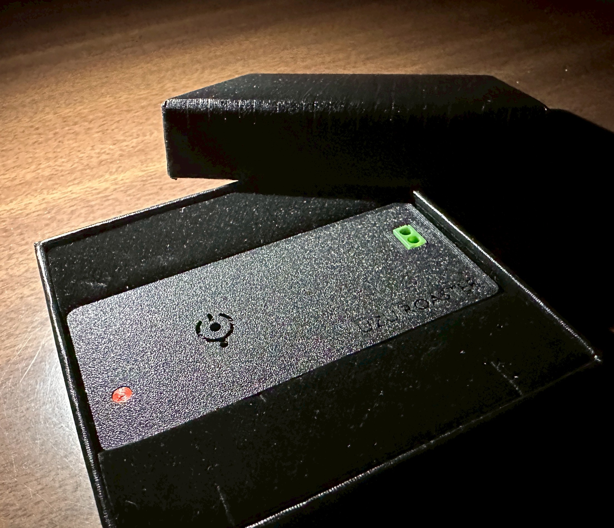

# 🌀 UZU ROASTER (UZ-01)

**ESP32ベースのオープンソース・コーヒー焙煎コントローラー**  
USBシリアル通信 ✕ Web技術 ✕ WiFiで実現する、次世代の小型焙煎機コントローラー



自家焙煎をもっと楽しく、もっと本格的に。  
うずうずコーヒー焙煎工房のオープンソース自動焙煎プロジェクトです。

---

## 🌟 これは何？

`UZU ROASTER` は、ESP32ベースの自作コーヒー焙煎機コントローラーです。  
ブラウザUIやPCアプリからリアルタイムで温度を可視化・制御でき、Artisanとの連携も可能です。

---

## ✨ Features

- 🌡️ **熱電対センサー（MAX31855）** による高精度温度計測・移動平均処理
- 📊 **Artisan連携** — WebSocket経由でリアルタイム温度送信
- 📱 **ブラウザUI** — スマホ・PCどちらからでも操作可能（WiFiアクセスポイントモード）
- 🖥️ **PCアプリ版** — `uzuroaster.exe` でUSBシリアル接続にも対応
- 🔁 **焙煎プロファイル管理** — プロファイルの記録・再現・比較
- 💡 **LEDステータス表示** — 焙煎中・接続状態を視覚的にフィードバック
- ⚙️ **サーボモーター制御** — ダンパー等の自動制御に対応
- 🛠️ **3Dプリント対応ケース** — コンパクト設計

---

## 🚀 クイックスタート

### WiFi接続で使う（ESP32単体）

1. ESP32に `Artisan_sample.ino.bin` を書き込む
2. WiFi `UZU-ROASTER` に接続
3. ブラウザで `http://192.168.4.1` にアクセス

### PCアプリで使う（Windows）

1. [Releases](../../releases) から `uzuroaster.exe` をダウンロード
2. UZU本体をUSBでPCに接続（CH340 USB Serialドライバが必要）
3. `uzuroaster.exe` をダブルクリックして起動
   - ※初回起動時にWindowsの警告が出る場合は「詳細情報」→「実行」
4. 「Connect」または「START」ボタンで焙煎開始

---

## 🔧 Hardware Requirements

| パーツ | 仕様 |
|--------|------|
| マイコン | ESP32 (推奨: ESP32-DevKitC) |
| 温度センサー | MAX31855 + K型熱電対 |
| サーボモーター | 一般的なPWMサーボ |
| ケース | 3Dプリント（STLファイル準備中） |

### ピン配置

| 機能 | GPIO |
|------|------|
| MAX31855 DO (SO) | 19 |
| MAX31855 CS | 5 |
| MAX31855 CLK (SCK) | 18 |
| サーボ PWM | 14 |
| ステータスLED | 2 |
| BOOTボタン | 0 |

---

## 📦 Software Requirements

Arduino IDE に以下のライブラリをインストールしてください：

- `ESP32Servo`
- `ESPAsyncWebServer`
- `WebSocketsServer` (Links2004/arduinoWebSockets)
- `DNSServer`
- `Adafruit_MAX31855`
- `ArduinoJson`
- `WebSerial`
- `LittleFS`

---

## 🔨 ファームウェアの書き込み

**ビルド済みバイナリを使う場合（簡単）:**

```bash
esptool.py --port /dev/ttyUSB0 write_flash 0x10000 Artisan_sample.ino.bin
```

または [ESP Flash Download Tool](https://www.espressif.com/en/support/download/flash-download-tools) を使用。

**Arduino IDEでビルドする場合:**

`Artisan_sample.ino` をArduino IDEで開いてビルド・書き込み。

### Webフロントエンドのアップロード

`index.html` / `script.js` / `chart.js` / `favicon.ico` をLittleFSにアップロード。  
起動後にブラウザの `http://192.168.4.1/upload` から直接アップロードできます。

---

## 📡 Artisan連携

Artisan の **デバイス設定** で以下を設定：

- **Device:** `WebSocket`
- **Host:** `192.168.4.1`
- **Port:** `81`

---

## 🛠 開発者向け（Pythonで実行する場合）

```bash
pip install pywebview pyserial
python uzuroaster.py
```

**exe化する場合:**

```bash
python -m PyInstaller --noconsole --onefile --hidden-import=webview --add-data "index.html;." uzuroaster.py
```

---

## ⌨️ シリアルコマンド

USBまたはブラウザのコンソールから使えます：

| コマンド | 説明 |
|---------|------|
| `start` | 焙煎開始 |
| `stop` | 焙煎停止 |
| `reset` | リスタート |
| `temp on/off` | 温度シリアル出力 ON/OFF |
| `interval [ms]` | 温度送信間隔設定 |
| `ssid [name]` | WiFi SSID変更 |
| `ip [x.x.x.x]` | IPアドレス変更 |
| `simulate on/off` | シミュレーションモード |
| `ls` | LittleFS ファイル一覧 |

---

## 📁 Repository Structure

```
uzuroaster/
├── Artisan_sample.ino        # メインファームウェア
├── Artisan_sample.ino.bin    # ビルド済みバイナリ
├── index.html                # ブラウザUI
├── script.js                 # フロントエンドJS
├── chart.js                  # グラフライブラリ
├── sample_profile.json       # サンプル焙煎プロファイル
├── uzuroaster.py             # PCアプリ版（PyWebView）
├── uzuroaster.exe            # PCアプリ版（Windows実行ファイル）
└── uzu_roaster_manual.html   # マニュアル
```

---

## 🤝 コントリビュート

バグ報告や機能要望は Issue または Pull Request までお気軽にどうぞ！  
コーヒー片手に楽しく開発しています。☕️

---

## 📄 License

MIT License — 自由に使ってください。

---

## 🏪 About

[うずうずコーヒー焙煎工房](https://uzuuzu.shop/uzuroastery/)  
奈良県橿原市の自家焙煎コーヒー工房が開発したオープンソースプロジェクトです。

---

*Developed by Yoshihiko Ida / UzuuzuHonpo*  
*Roasting the future with Code and Beans. ☕*
